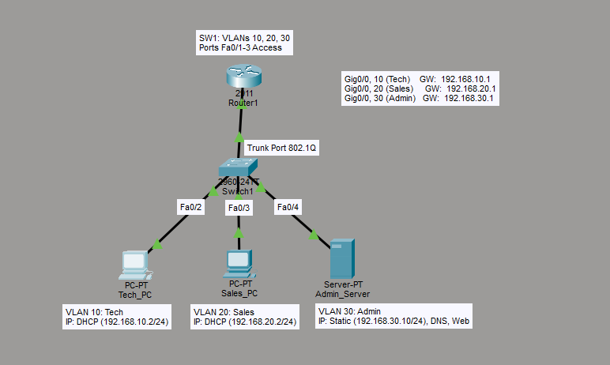

# Secure Multi-VLAN Corporate Network (Router-on-a-Stick)

## 📌 Project Overview

This project demonstrates a production-ready small enterprise network designed in Cisco Packet Tracer. It solves the challenge of internal network security and broadcast traffic management by implementing VLAN Segmentation, Inter-VLAN Routing, and Traffic Filtering.

**Scenario:** A growing company required logical separation between its Tech, Sales, and Admin departments to improve network performance (reduce broadcast domains) and secure sensitive administrative servers from unauthorized access by the Sales team.

## 🛠️ Technical Stack & Skills

- **Architecture:** Router-on-a-Stick (ROAS)
- **Encapsulation:** IEEE 802.1Q (Dot1q)
- **VLANs:** Logical separation of Tech, Sales, and Admin departments.
- **DHCP:** Router-based pools for dynamic IPv4 allocation.
- **Security:** Extended Access Control Lists (ACLs) to protect server resources.
- **Switching:** Trunking, Access Ports, and MAC Address table management.

## 🗺️ Network Topology



## 📊 Network Specifications

| Department | VLAN | Subnet | Gateway | Assignment |
|------------|------|--------|---------|------------|
| Tech | 10 | 192.168.10.0/24 | 192.168.10.1 | DHCP |
| Sales | 20 | 192.168.20.0/24 | 192.168.20.1 | DHCP |
| Admin | 30 | 192.168.30.0/24 | 192.168.30.1 | Static (.10) |

## ⚙️ Configuration Highlights

### 1. Inter-VLAN Routing (Sub-Interfaces)
Traffic is routed between VLANs using logical sub-interfaces on a single physical link.
```cisco
interface GigabitEthernet0/0.10
 encapsulation dot1Q 10
 ip address 192.168.10.1 255.255.255.0

interface GigabitEthernet0/0.20
 encapsulation dot1Q 20
 ip address 192.168.20.1 255.255.255.0
```

### 2. DHCP Server Configuration
The router acts as the DHCP server, automatically assigning IPs, Subnet Masks, and Default Gateways to end devices in the Tech and Sales VLANs.
```cisco
ip dhcp pool TECH_POOL
 network 192.168.10.0 255.255.255.0
 default-router 192.168.10.1
 
ip dhcp pool SALES_POOL
 network 192.168.20.0 255.255.255.0
 default-router 192.168.20.1
```

### 3. Layer 2 Trunking
The switch port connected to the router must be configured as an 802.1Q trunk to carry traffic for multiple VLANs simultaneously.
```cisco
interface GigabitEthernet0/1
 switchport mode trunk
 no shutdown
```

### 4. Traffic Security (Extended ACL)
The Admin_Server is secured to allow only authorized traffic from the Tech department while blocking the Sales department entirely.
```cisco
ip access-list extended SECURE_ADMIN
 permit ip 192.168.10.0 0.0.0.255 host 192.168.30.10
 deny ip 192.168.20.0 0.0.0.255 host 192.168.30.10
 permit ip any any

interface GigabitEthernet0/0.30
 ip access-group SECURE_ADMIN out
```

## 🚧 Challenges & Troubleshooting

During the build process, several real-world networking challenges were encountered and resolved:

- **Sub-Interface State Mapping**: Discovered that logical sub-interfaces will remain in an "Administratively Down" state until the primary physical interface (`GigabitEthernet0/0`) is explicitly brought up using `no shutdown`.
- **Switchport Trunk Negotiation**: Resolved an issue where the router's protocol state remained down by ensuring the corresponding switch port was manually forced into trunk mode (`switchport mode trunk`) rather than relying on DTP negotiation.
- **DHCP APIPA Resolution**: Diagnosed PCs receiving `169.254.x.x` addresses by tracing the failure back to the Layer 2 trunking connection not forwarding VLAN tags to the router.

## ✅ Verification & Testing

- **DHCP Success**: All client PCs successfully leased IP addresses from the router. No APIPA addresses were generated.
- **Connectivity**: Tech and Sales VLANs can communicate via the ROAS gateway successfully.
- **Security Enforcement**: 
  - Tech PC to Admin Server: Ping SUCCESS (Authorized access).
  - Sales PC to Admin Server: Destination Host Unreachable (ACL Blocked).

## 🔮 Future Enhancements

- Implement Port Security on switch access ports to prevent unauthorized device connections.
- Configure SSH (Secure Shell) on the router and switch for secure remote management.
- Introduce a second site connected via Serial WAN links running a dynamic routing protocol like OSPF.

## 📂 Project Files

- `Corporate_Network.pkt`: Functional Cisco Packet Tracer lab file.
- `Router_Config.txt`: Full running-configuration for R1.
- `Switch_Config.txt`: Full running-configuration for SW1.

## 🚀 How to Use

1. Download the `.pkt` file.
2. Open with Cisco Packet Tracer (v8.0+).
3. Use the Command Prompt on end devices to verify routing and security rules.

---

**Author:** Saranesh Dhatchinamoorthy  
**LinkedIn:** www.linkedin.com/in/saranesh-dhatchinamoorthy  
**Date:** March 2026
